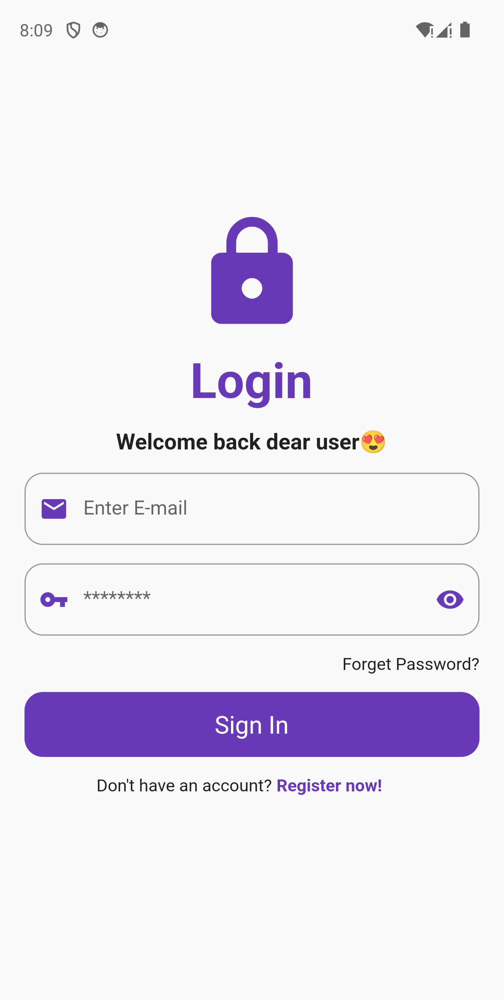
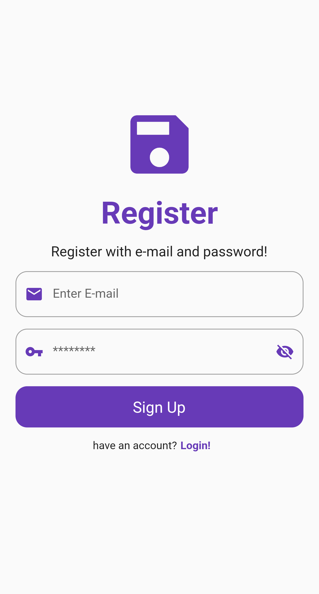
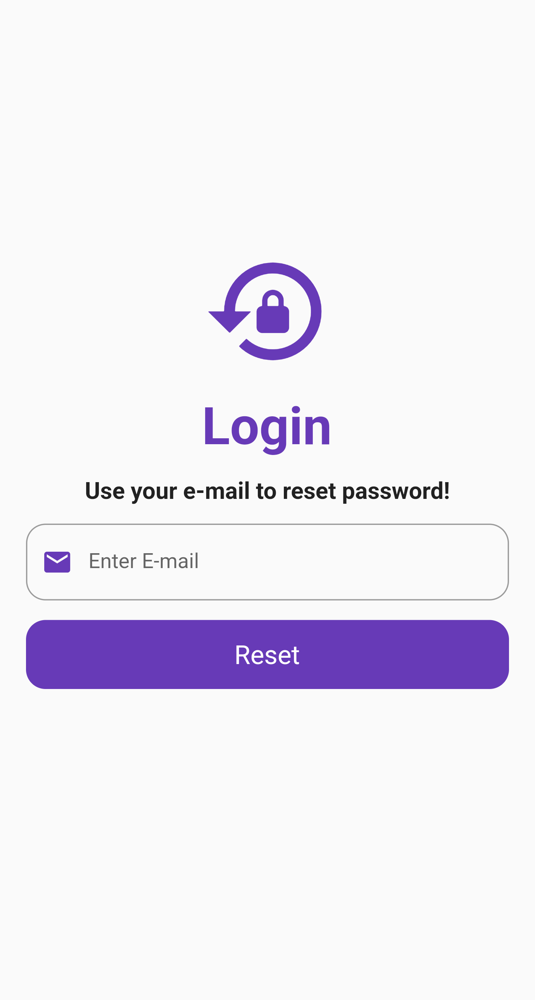

# Flutter and Firebase Authentication

## Login Screen



## Registration Screen



## Reset Screen



## Description

This is a Flutter app that demonstrates Firebase authentication. The app allows users to sign up, sign in, sign out, and reset their password using Firebase Authentication.


## Features

- User Registration: Allow users to create a new account.
- User Authentication: Enable users to sign in with their credentials.
- Password Reset: Allow users to reset their password if forgotten.
- Sign Out: Provide an option for users to sign out.

## Technologies Used

- Flutter: A UI toolkit for building natively compiled applications for mobile, web, and desktop from a single codebase.
- Firebase Authentication: Firebase Authentication provides backend services, easy-to-use SDKs, and ready-made UI libraries to authenticate users to your app.

## Getting Started

1. Clone the repository:

   ```bash
   git clone https://github.com/Badrudin-cloud/flutter-firebase-authentication.git
